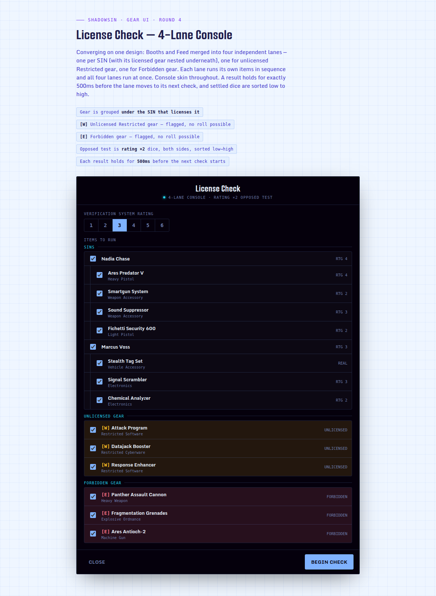
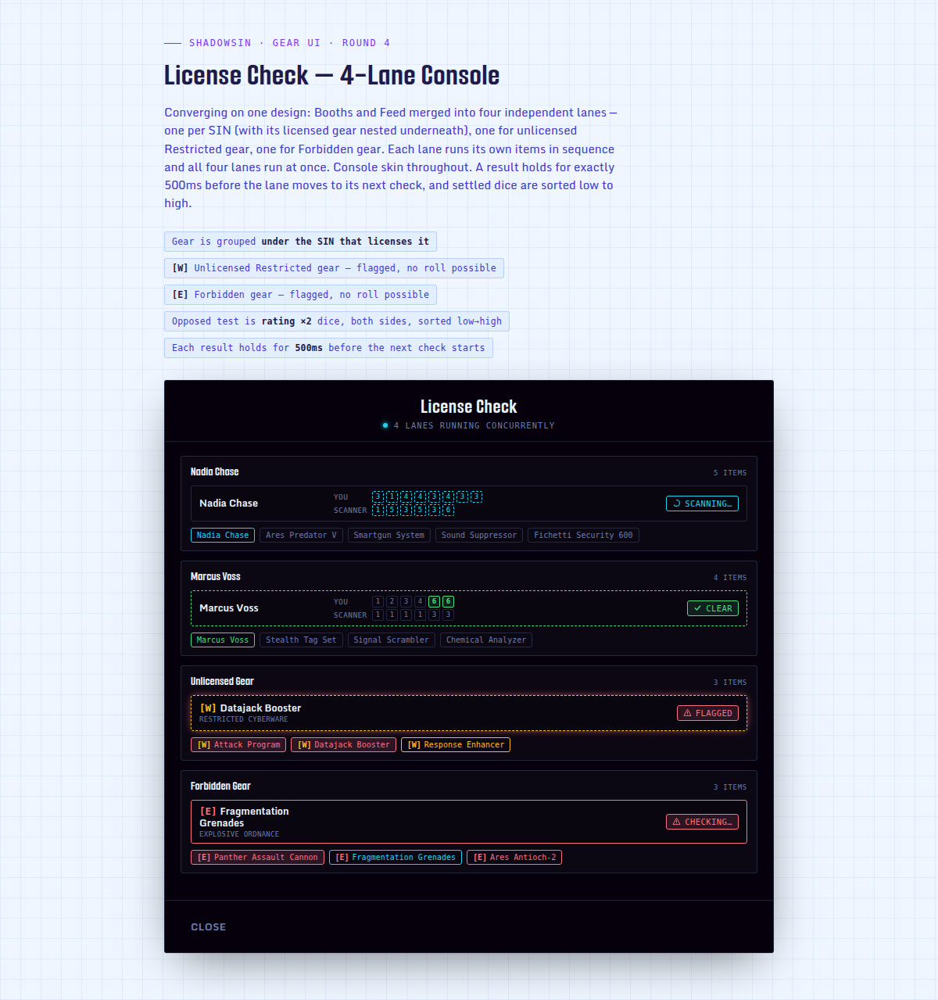
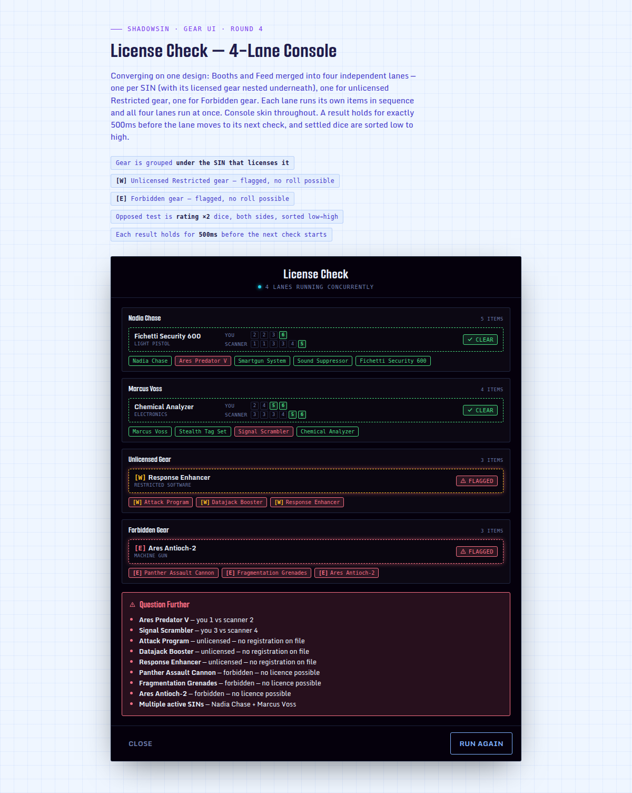

# License Check Dialog

> **Status:** Ready to Implement
>
> **GitHub Issues / PRs:**
> - [#389 — House Rules feature-flag namespace](https://github.com/CptnFizzbin/shadow-sin/issues/389)
> - [#391 — Trigger + Setup screen](https://github.com/CptnFizzbin/shadow-sin/issues/391)
> - [#393 — Scan mechanics](https://github.com/CptnFizzbin/shadow-sin/issues/393)
> - [#394 — Alerts + result screen](https://github.com/CptnFizzbin/shadow-sin/issues/394)
> - Does *not* depend on [`docs/features/0012-item-stashing.md`](./0012-item-stashing.md)'s
>   [#388](https://github.com/CptnFizzbin/shadow-sin/issues/388) after all — see Domain Notes below

A simulated security scan of a Runner's carried gear: a **Verification System Rating** (1–6) is
set, then every carried SIN and every Restricted item is opposed-tested against it to see whether
the fake credentials backing them hold up. The design converged over four rounds of interactive
prototyping (screenshots below) — this doc captures the mechanics and resolved design decisions
to hand off to implementation.

**Prototype record** (screenshots of the converged Round 4 design — "4-Lane Console" — walking the
full flow; the original was a private Claude Artifact, captured here as static images so the
record doesn't depend on that link staying alive. Earlier rounds 1–3 were superseded and are not
included):

1. Setup — rating picker and per-item checklist, grouped into SIN / Unlicensed / Forbidden lanes:



2. Scan in progress — all four lanes resolving concurrently, dice mid-roll:



3. Result — Question Further state, listing every flagged item and reason (including the
   multi-SIN alert):



## Mechanics (settled)

- **Trigger:** Player self-check only for v1 — a Runner's own Player runs it against their own
  carried gear before a run ("am I clean?"). No GM tool: the app has no Game/GM concept at all
  today (`docs/features/0003-gm-game.md` is still Draft), so a GM-facing trigger is out of scope
  until that lands.
- **Verification System Rating source:** a plain 1–6 input the Player sets fresh every run, as
  prototyped. No new entity, no persistence — this is not tied to a location/checkpoint concept.
- **Setup step:** a 1–6 button group sets the Verification System Rating. A checklist lists every
  eligible item, grouped as:
  - **SINs** — every owned `SinData` item, unbounded. A SIN is a held identity, not carried gear,
    so it has no equip/carry state and no eligibility filter of its own — it's always listed, with
    or without licensed gear submitted underneath it, so it can be verified standalone (e.g. a
    scan that only checks whether the identity itself holds up, no gear involved). Each SIN is a
    group header, with the Restricted gear covered by a Licence attached to that SIN nested
    underneath it (via `Licence.parentId` → SIN, `ItemData.licenseId` → Licence).
  - **Unlicensed Gear** — Restricted items with no `licenseId` at all. Confirmed reachable today:
    `isItemLicensed` (`licenseUtils.ts`) treats a missing or dangling `licenseId` as unlicensed,
    and `0001-license-quick-buy.md`'s own Resolved Questions note there is no SIN-burning
    mechanic to clean up a dangling reference after a Licence is deleted.
  - **Forbidden Gear** — items with restriction code `F`.
  - Unrestricted gear is never listed — there's nothing to check.
  - Every row, including a SIN's own, has a checkbox, checked by default; unchecking one excludes
    just that item from this run without touching any persisted state — a dialog-local selection
    (`LicenseCheckContext`), not the item's `stashed` flag from
    [`docs/features/0012-item-stashing.md`](./0012-item-stashing.md). A SIN is scanned when its own
    checkbox is checked, or when at least one of its licensed gear is still checked — presenting a
    piece of gear implies presenting the identity backing it, so checking gear alone is still
    enough to pull the SIN into the queue. A SIN with neither its own box nor any of its gear
    checked isn't scanned — nothing to verify.
- **Scan step:** every checked item — across every SIN, Unlicensed Gear, and Forbidden Gear — is
  flattened into one shuffled queue. Four worker "terminals" run concurrently, each pulling the
  next check off that shared queue as soon as it finishes its current one, until the queue is
  drained.
- **Per-item resolution:**
  - A **real** SIN or Licence clears instantly — no roll.
  - A **fake** SIN or Licence rolls an Opposed Test: `rating × 2` d6 for the credential vs.
    `Verification System Rating × 2` d6 for the scanner. A Hit is a 5 or 6 (existing definition).
    Whichever side has more Hits wins; a tie favours the credential (it holds). The `× 2`
    multiplier ships as fixed default-on behavior gated behind a new feature flag,
    `items.licenseCheck.ratingPlusRating` (defaults to enabled) — see Constraints below for why
    this doesn't use the existing `optionalRules` mechanism.
  - **Unlicensed** and **Forbidden** items have nothing to oppose — they're flagged immediately,
    no roll.
  - A resolved result (dice + verdict) holds on screen for exactly 500ms before the worker pulls
    its next queued item. Settled dice are displayed sorted high → low on both sides.
  - Scan duration for a rolled item is not fixed — it scales with the total dice pool size, so a
    higher-rated fake credential visibly takes longer to resolve than a low-rated one.
- **Alerts:** two active SINs at once is *always* an alert, independent of how the individual
  rolls go. Any alert (a flagged item, or the multi-SIN condition) puts the dialog in a
  **Question Further** state that lists every flagged item and a short reason. No alerts →
  **All Clear**.
- **Lasting effects:** none. License Check is purely informational — a flagged result is not
  logged, does not notify a GM, does not confiscate the item, and does not feed Public Awareness /
  Notoriety. The dialog shows results and closes; nothing is written to `RunnerData` as a
  consequence of a check.
- **Tone:** no narrative/flavour text anywhere in the dialog — item rows show name, category, and
  dice only; reasons are short mechanical strings (e.g. `you 3 vs scanner 4`), not prose.

## Constraints

- Availability/restriction codes already exist: `R` (Restricted) requires a Licence, `F`
  (Forbidden) has no legal Licence path (`AvailabilityChip`, `availabilityInfo.ts`). Forbidden
  gear must never be offered a roll — matches the existing Licence Quick-Buy rule that Forbidden
  items get no quick-buy trigger either.
- `LicenseData.rating` / `SinData.rating` are `"real" | number` — a `"real"` value must always
  auto-clear and must never be rolled.
- Licence → SIN is the existing Attachment relationship (`Licence.parentId` = SIN id). Gear →
  Licence is the existing flat reference (`ItemData.licenseId`). No new relationship fields are
  needed to build the lane groupings.
- `Hit` (die result of 5 or 6) is the existing dice-pool definition and must be reused, not
  redefined, for the Opposed Test.
- The checklist's per-item checked/unchecked state is a dialog-local selection
  (`LicenseCheckContext`), not `ItemData.stashed` — it doesn't depend on
  [`docs/features/0012-item-stashing.md`](./0012-item-stashing.md) landing first. `gear/stashItem`
  exists as a stub action ahead of that field for a future persisted-stash affordance, but License
  Check itself never dispatches it.
- `rating × 2` is a **House Rule**, not an Optional Rule — it's a prototyping pacing choice, not a
  published SR4e variant, so it carries no `Source` citation and lives in `featureFlags.houseRules`
  rather than `featureFlags.optionalRules`. See
  [`docs/adr/0005-house-rules-feature-flag-namespace.md`](../adr/0005-house-rules-feature-flag-namespace.md)
  for why this is a separate registry rather than a misuse of `optionalRulesRegistry`.
- Implementation must follow the established dialog pattern (`useDialog` + compound `Dialog`
  component, per `docs/ui/dialog.md`) and MUI style-prop discipline (no restating theme
  defaults) — the prototypes are bespoke HTML/CSS mockups, not real MUI components, and should
  not be treated as a component-level reference beyond layout and interaction intent.

## Domain Notes

Existing terms in play: **SIN**, **Licence**, **Availability**, **Restricted**, **Forbidden**,
**Hit**, **Dice Pool**, **Opposed Test**, **Optional Rule**.

`Opposed Test` already exists (`TestType.Opposed` in the dice tray, `src/components/dice/testType.ts`)
but there only one side is rolled digitally — the opposing Hit count is entered manually, since
the dice tray doesn't track an opposing character. License Check is a second consumer of the same
concept: it rolls both sides digitally in one place, since both pools (credential rating,
Verification System Rating) are values the app already tracks. `CONTEXT.md`'s `Opposed Test` entry
was broadened to cover both call sites — this feature does not introduce a new term for its dice
mechanic, it reuses the existing one.

New terms this feature introduces to `CONTEXT.md`:

- **License Check** — the simulated verification flow itself.
- **Verification System Rating** — the 1–6 rating representing the scanning system's strength for
  one License Check run; forms one side of each Opposed Test.

`Stash` is defined by [`docs/features/0012-item-stashing.md`](./0012-item-stashing.md), not by
this feature. License Check ended up not consuming that flag at all — its checklist tracks its own
ephemeral checked/unchecked selection instead (see Resolved Design Decisions above).

## Rough Interface Sketches

_High-level shapes only — no implementation code._

```ts
type CredentialRating = "real" | number // matches existing SinData/LicenseData.rating

interface VerificationLane {
  key: string // a SIN's id, or "unlicensed" / "forbidden"
  title: string // the SIN's display name, or "Unlicensed Gear" / "Forbidden Gear"
  checks: VerificationCheck[] // Setup checklist display order — the scan runs its own shuffled, flattened queue
}

interface VerificationCheck {
  itemId: string // SinData.id or ItemData.id
  kind: "sin" | "licensed-gear" | "unlicensed-gear" | "forbidden-gear"
  credentialRating?: CredentialRating // absent for unlicensed/forbidden — nothing to roll
}

interface VerificationOutcome {
  itemId: string
  status: "clear" | "flagged"
  credentialHits?: number
  scannerHits?: number
}

interface LicenseCheckResult {
  scannerRating: number // 1–6, set for this run
  outcomes: VerificationOutcome[]
  alerts: Array<{ itemId: string | "multiple-sins"; reason: string }>
}
```

## Out of Scope

- Any lasting consequence to `RunnerData` from a flagged result (confiscation, arrest, Notoriety
  change, GM notification) — this is purely an informational simulation.
- A GM-facing trigger or GM-side configuration of checkpoint/scanner presets — no GM tooling
  exists yet (`docs/features/0003-gm-game.md`).
- Editing or creating SINs/Licences from within this dialog — that's the existing SIN/Licence
  forms and the Licence Quick-Buy flow.
- Changes to the core dice engine beyond this feature's own Opposed Test — the `rating × 2`
  formula is scoped to License Check only, not a change to Dice Pool assembly elsewhere.
- Real-time or multiplayer presentation of a check (e.g. a GM watching a Player's scan live).
- The general item-stashing mechanic itself (flag definition, equip-blocking, gear-list
  presentation) — that lives in
  [`docs/features/0012-item-stashing.md`](./0012-item-stashing.md); License Check doesn't consume
  it, per the pivot noted in Domain Notes above.

## Related Features

- [`docs/features/0001-license-quick-buy.md`](./0001-license-quick-buy.md) — this feature's SIN ↔
  Licence ↔ gear data model is the foundation the lane grouping is built on
- [`docs/features/0003-gm-game.md`](./0003-gm-game.md) — relevant to the "who triggers this?"
  decision above; still Draft, no GM view exists yet
- [`docs/features/0012-item-stashing.md`](./0012-item-stashing.md) — License Check ended up not
  depending on this; its checklist's checked/unchecked state is its own ephemeral mechanic, not a
  consumer of `ItemData.stashed`
